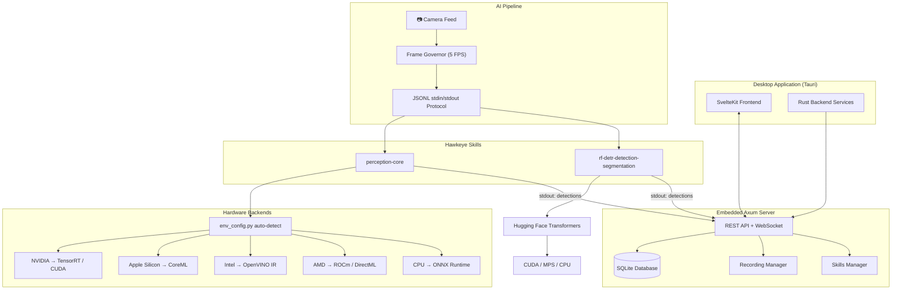
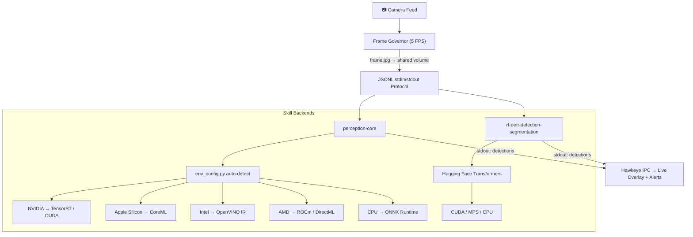

<div align="center">
<h1>Hawkeye — Intelligent Surveillance System</h1>

<p>Hawkeye is an intelligent surveillance system that transforms any camera into a smart monitoring solution. It provides local AI inference for scene analysis, object detection, person re-identification, and more — running entirely on your own hardware with models like Qwen, DeepSeek, SmolVLM, and LLaVA. Built on proven facial recognition, RE-ID, fall detection, and CCTV/NVR surveillance monitoring, the skill catalog extends these machine learning capabilities with modern AI. All inference runs locally for maximum privacy.</p>
</div>

---


## 🏗️ Architecture

Hawkeye is a modern desktop application built with:

- **Tauri (Rust)** — Lightweight, secure desktop runtime with an embedded Axum web server
- **SvelteKit + Tailwind CSS** — Fast, reactive web frontend
- **Skill Architecture** — Pluggable Python skills communicating via JSONL over stdin/stdout
- **go2rtc** — Low-latency WebRTC streaming for live camera views
- **SQLite** — Local database for events, identities, recordings, and settings

### System Architecture



---

## 🧩 Skill Catalog

Each skill is a self-contained module with its own model, parameters, and [communication protocol](docs/skill-development.md). See the [Skill Development Guide](docs/skill-development.md) and [Platform Parameters](docs/skill-params.md) to build your own.

| Category | Skill | What It Does |
|----------|-------|--------------|
| **Detection** | [`perception-core`](skills/detection/perception-core/) | Unified perception pipeline — YOLO object detection + ByteTrack tracking + ROI face detection + face recognition, with auto-accelerated backends (TensorRT / CoreML / OpenVINO / ONNX) |
| | [`rf-detr-detection-segmentation`](skills/detection/rf-detr-detection-segmentation/) | RF-DETR detection + instance segmentation via Hugging Face Transformers |
| **Camera Providers** | [`eufy`](skills/camera-providers/eufy/) · [`reolink`](skills/camera-providers/reolink/) · [`tapo`](skills/camera-providers/tapo/) | Vendor camera integrations — local RTSP / ONVIF discovery / clip retrieval |
| **Streaming** | [`go2rtc-cameras`](skills/streaming/go2rtc-cameras/) | Registers RTSP streams with go2rtc for low-latency WebRTC live views |
| **Channels** | [`telegram`](skillsfriend/channels/telegram/) · [`signal`](skills/channels/signal/) · [`matrix`](skills/channels/matrix/) · [`line`](skills/channels/line/) | Messaging channels for the agent — alerts, search, control |
| **Automation** | [`mqtt`](skills/automation/mqtt/) · [`webhook`](skills/automation/webhook/) · [`ha-trigger`](skills/automation/ha-trigger/) | Event-driven automation triggers |
| **Integrations** | [`homeassistant-bridge`](skills/integrations/homeassistant-bridge/) · `camera-claw` | HA cameras in ↔ detection results out · OpenClaw security sandbox |

> **Registry:** All skills are indexed in [`skills.json`](skills.json) for programmatic discovery.

### Detection Skills

Detection skills process visual data from camera feeds — detecting objects or analyzing scenes. All skills use the same **JSONL stdin/stdout protocol**: Hawkeye writes a frame to a shared volume, sends a `frame` event on stdin, and reads `detections` from stdout. Every detection skill is interchangeable from Hawkeye's perspective.



- **Unified protocol** — each skill creates its own Python venv, but Hawkeye sees the same JSONL interface regardless of backend
- **Same output** — Hawkeye sees identical JSONL from all skills, so detection overlays, alerts, and forensic analysis work with any backend
- **Hardware-aware install** — `perception-core` ships per-backend `requirements_{cpu,cuda,mps,rocm,intel}.txt` files; the LLM installer picks the right one at deploy time

#### LLM-Assisted Skill Installation

Skills are installed by an **autonomous LLM deployment agent** — not by brittle shell scripts. When you click "Install" in Hawkeye, a focused mini-agent session reads the skill's `SKILL.md` manifest and figures out what to do:

1. **Probe** — reads `SKILL.md`, `requirements.txt`, and `package.json` to understand what the skill needs
2. **Detect hardware** — checks for NVIDIA (CUDA), AMD (ROCm), Apple Silicon (MPS), Intel (OpenVINO), or CPU-only
3. **Install** — runs the right commands (`pip install`, `npm install`, system packages) with the correct backend-specific dependencies
4. **Verify** — runs a_mid smoke test to confirm the skill loads before marking it complete
5. **Determine launch command** — figures out the exact `run_command` to start the skill and saves it to the registry

This means community-contributed skills don't need a bespoke installer — the LLM reads the manifest and adapts to whatever hardware you have. If something fails, it reads the error output and tries to fix it autonomously.


## 🚀 Getting Started with Hawkeye

The easiest way to run Hawkeye's AI skills. Hawkeye connects everything — cameras, models, skills, and you.

- 📷 **Connect cameras in seconds** — add RTSP/ONVIF cameras, webcams, or iPhone cameras for a quick test
- 🤖 **Built-in local LLM & VLM** — llama-server included, no separate setup needed
- 📦 **One-click skill deployment** — install skills from the catalog with AI-assisted troubleshooting
- 🔽 **One-click HuggingFace downloads** — browse and run Qwen, DeepSeek, SmolVLM, LLaVA, MiniCPM-V
- 📊 **Find the best VLM for your machine** — benchmark models on your own hardware with HomeSec-Bench
- 💬 **Talk to your guard** — via Telegram, Discord, or Slack. Ask what happened, tell it what to watch for, get AI-reasoned answers with footage.

### Development Setup

Hawkeye is built with **Tauri v2**, **SvelteKit**, and **Rust**. To run the desktop app locally:

**Prerequisites:**
- [Rust](https://rustup.rs/)
- [Node.js]((inner>https://nodejs.org) (v18+)
- [Tauri CLI](https://v2.tauri.app/reference/cli/)

**Build & Run:**
```bash
# Install frontend dependencies
cd frontend
npm install

# Return to root and start the Tauri app
cd ..
npm run tauri dev
```

The app will open with the SvelteKit frontend served by the embedded Rust Axum server.

---

## ⚡ Hardware Acceleration

The shared [`env_config.py`](skills/lib/env_config.py) **auto-detects your GPU/NPU** and lets each skill convert its model to the fastest native format — zero manual setup. Skills consume this through a single import:

| Your Hardware | Optimized Format | Runtime |
|---------------|-----------------|---------|
| **NVIDIA GPU** (RTX, Jetson) | TensorRT `.су .engine` / ONNX-CUDA | CUDA |
| **Apple Silicon** (M1–M4) | CoreML `.mlpackage` | Apple Neural Engine + GPU |
| **Intel** (CPU, iGPU, NPU) | OpenVINO IR `.xml` | OpenVINO |
| **AMD GPU** (RX, MI) | ONNX Runtime + ROCm / DirectML | ROCm |
| **Any CPU** | ONNX Runtime | CPU |
| **Google Coral USB Accelerator** | Edge TPU `.tflite` | ai-edge-litert + libedgetpu |

Detection runs as a **parallel pipeline** alongside VLM analysis — never blocks your AI agent:

```
Camera → Frame Governor → detect.py (JSONL) → Hawkeye IPC → Live Overlay
                5 FPS           ↓
                          perf_stats (p50/p95/p99 latency)
```

- 🖱️ **Click to setup** — one button in Hawkeye installs everything, no terminal needed
- 🤖 **AI-driven environment config** — autonomous agent detects your GPU, installs the right framework (CUDA/ROCm/CoreML/OpenVINO), converts models, and verifies the setup
- 📺 **Live bounding boxes** — detection results rendered as overlays on RTSP camera streams
- 📊 **Built-in performance profiling** — aggregate latency stats (p50/p95/p99) emitted every 50 frames
- ⚡ **Auto start** — set `auto_start: true` to begin detecting when Hawkeye launches


